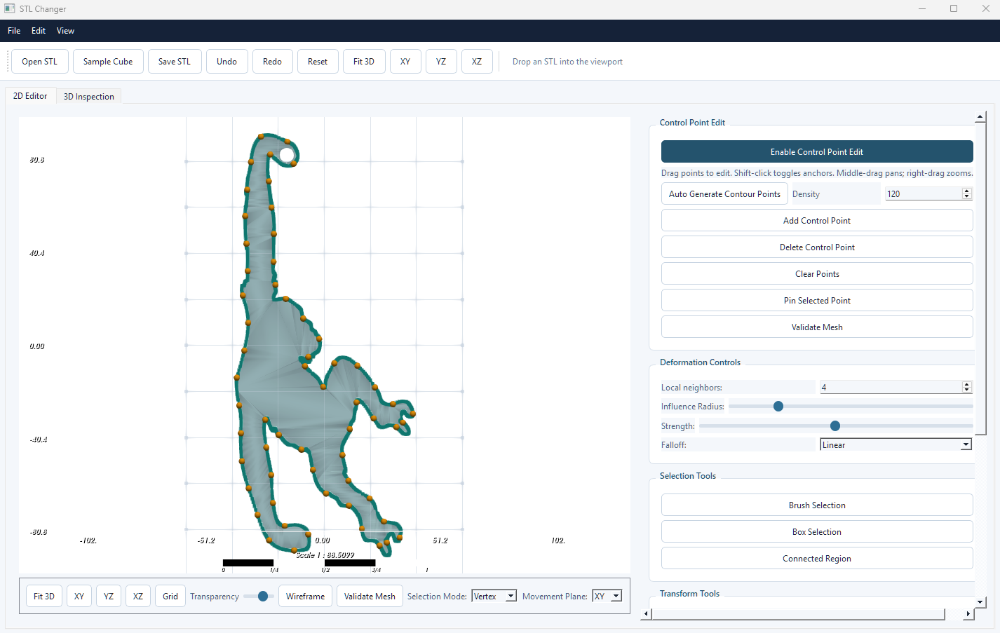
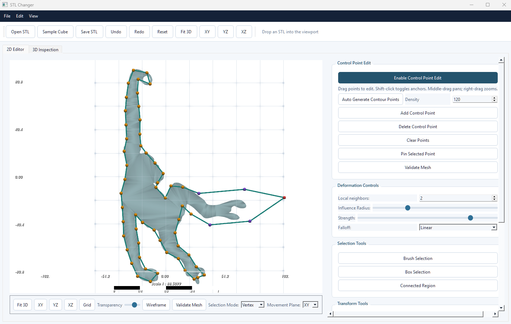

# STL Editor

STL Editor is a Python desktop application for local STL deformation through orthographic 2D contour editing. The XY, XZ, and YZ editor views are the only places where geometry can be changed; the 3D tab is read-only and intended for inspection.

## Features

- Open or drag-and-drop STL files.
- Edit the projected outer silhouette in XY, XZ, or YZ.
- View live horizontal and vertical rulers in every 2D editor (model units, usually millimeters).
- Toggle a model-space orientation grid in every 2D editor.
- Generate approximately equally spaced contour control points.
- Drag control points in the active 2D plane only.
- Choose smooth contour editing or point-wise editing for a direct local vertex change.
- Adjust influence radius and edit strength from the deformation controls.
- Shift-click control points to set anchors that constrain a local edit region.
- Preview selected, anchored, and locally affected control points.
- Transfer a compact local 2D displacement field to the STL without changing the third axis.
- Undo, redo, reset, validate, and export the current mesh.
- Inspect the edited mesh in a separate read-only 3D tab.

## Requirements

- Python 3.10 or newer
- A working OpenGL driver for the PyVista viewport

## Windows Setup

The project is tested with the `stl_editor` Conda environment:

```powershell
conda activate stl_editor
python -m pip install -r requirements.txt
python run.py
```

To create a new environment instead:

```powershell
conda create -n stl_editor python=3.11 -y
conda activate stl_editor
python -m pip install -r requirements.txt
python run.py
```

## Workflow

1. Open an STL file or choose **Load Sample Cube**.
2. Select **XY**, **XZ**, or **YZ**.
3. The projected outer contour and its control points appear.
4. Click a point to select it. Violet points show the local automatic influence region.
5. Drag the selected point to deform the local contour and nearby mesh region.
6. Use Shift-click to toggle two blue anchors and limit deformation to the contour section between them.
7. Open **3D Inspection** to review the modified mesh.
8. Save the current result as STL.

## Example

The screenshots below show the editor before and after a 2D contour adjustment. The grid, rulers, contour points, and read-only 3D inspection tab help keep the change easy to understand.





Controls in a 2D plane:

- Left drag: move a selected control point
- Shift + left click: toggle an anchor
- Middle drag: pan
- Right drag or mouse wheel: zoom

## Validation

**Validate Mesh** is read-only. It reports vertex/face counts, finite coordinates, degenerate faces, watertightness, winding consistency, volume status, dimensions, boundary edges, and non-manifold edges without modifying the mesh.

## Tests

Run the geometry regression suite with:

```powershell
python -m pytest -q
```

The suite covers projection invariance, contour resampling, local and anchored deformation, compact local mesh fields, self-intersection rejection, and validation compatibility with the installed `trimesh` API.

## Current Limitations

- The outer contour is edited; internal holes are not yet editable.
- The local deformation field uses compact weighted interpolation rather than ARAP or remeshing.
- Visual interaction should be tested on a desktop GPU because the PyVista viewport requires OpenGL.
